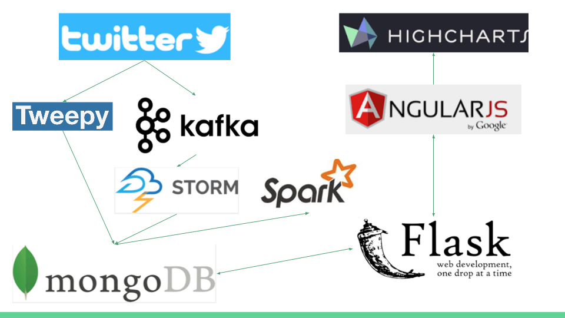
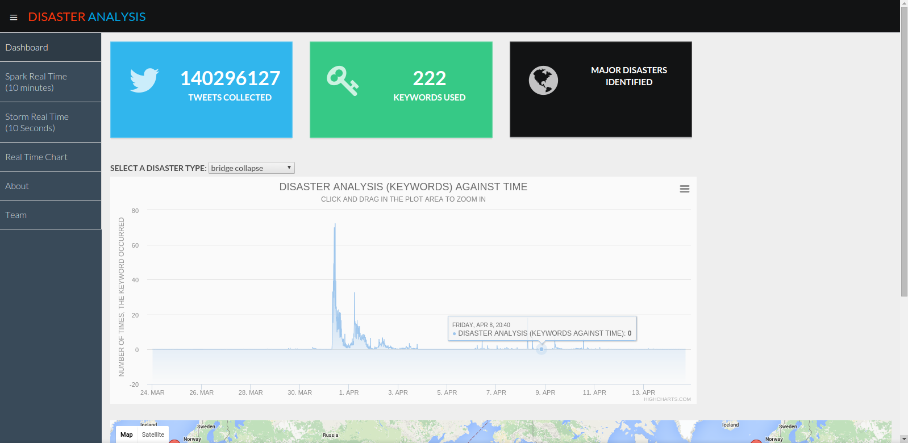
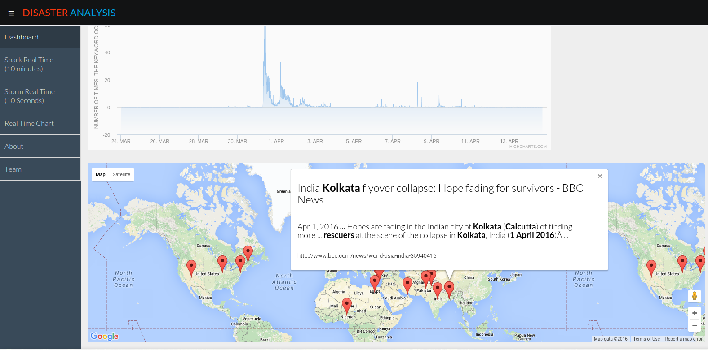
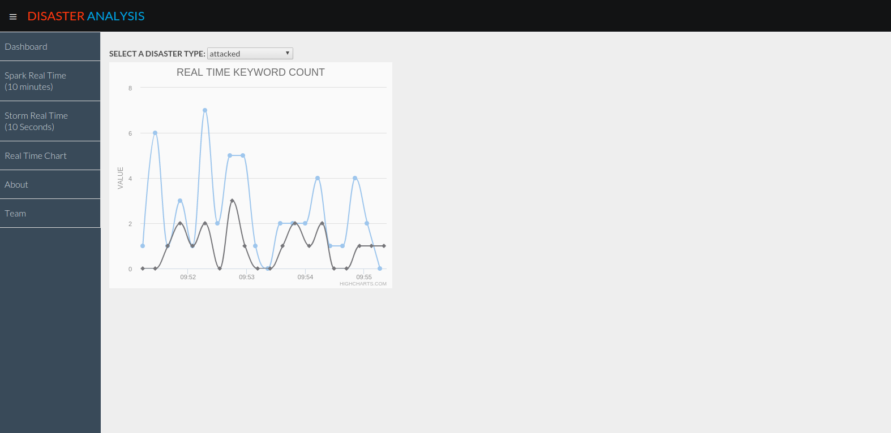
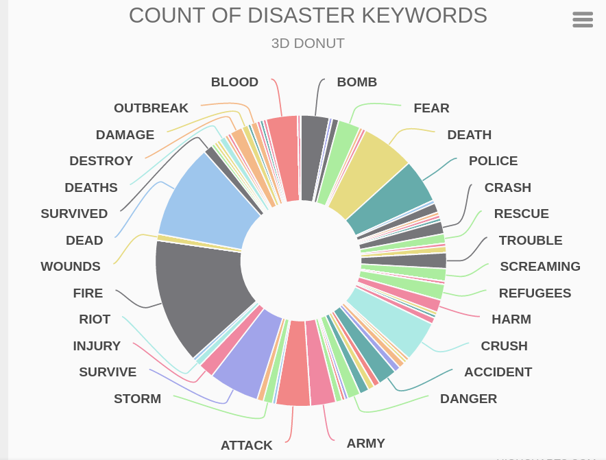
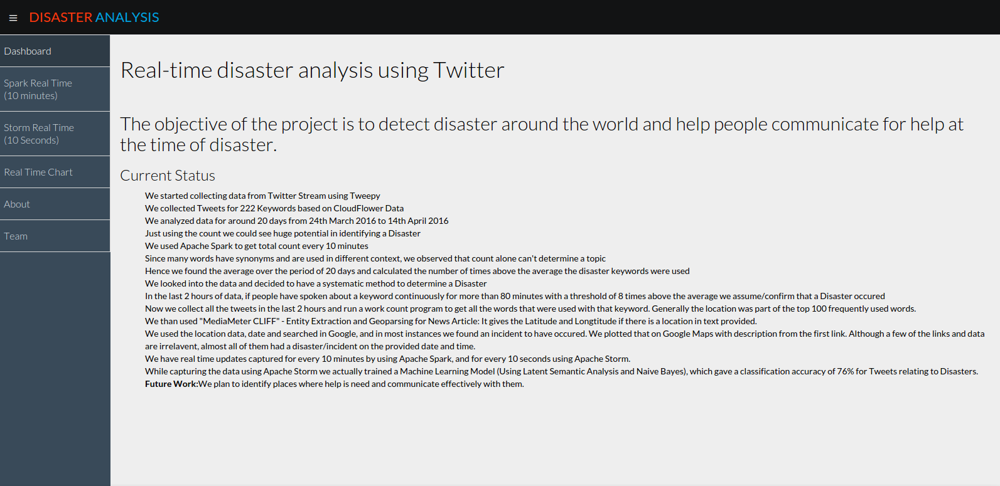
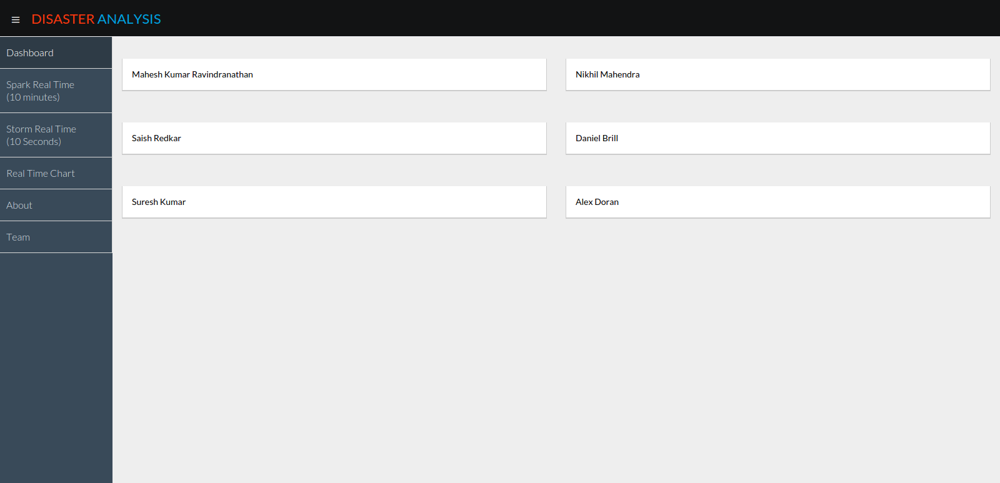

# Real-time disaster analysis using Twitter

[](https:/travis-ci.org/CUBigDataClass/Disaster-Analysis)
## The objective of the project is to detect disaster around the world and help people communicate for help at the time of disaster.

######Install Mongodb and virtualenv.
Get twitter developement account and application information by visiting: *https://apps.twitter.com ( Create a new app )*

######Steps: Initial Setup ( All of them to be done from home path of the repository. )


  * One time:

`mkdir data` ( To store the database content locally )

`virtualenv -p /usr/bin/python venv` ( To use a seperate python environment for this project )

`source venv/bin/activate` ( To active the virtual enviroment. Needs to be done every time.)

`pip install tweepy`

`pip install pymongo`

  * Everytime you want to get and store information:

`source venv/bin/activate`

`mongod --dbpath data/`

  - For testing the information that we are getting:

  	- Modify track to add more keywords for tracking.

`python extractTweets.py` 

  

  - For storing the data into Mongodb:

`python storeTweetsInMongoDBUsingTweepy.py`


######Getting Apache Spark Setup

`source venv/bin/activate`

  * Download the latest version of spark from https://spark.apache.org/downloads.html
  * I downloaded Pre-built for Hadoop 2.6 and later. Download and extract it. Store it in the directory of the virtual environment.
  * We need to setup our virtual environment to detect apache spark

  - Modify `venv/bin/activate` to point to the correct location as pointed in your system ( Line 49/50 )

`export SPARK_HOME=$VIRTUAL_ENV/../spark-1.6.0-bin-hadoop2.6`

`export PYTHONPATH=$SPARK_HOME/python:$SPARK_HOME/python/build:$PYTHONPATH`

  - Install py4j and pytz which is a library on which pyspark is dependent on.

`pip install py4j`

`pip install pytz`

######Getting MongoDB connector installed ( https://github.com/mongodb/mongo-hadoop/blob/master/spark/src/main/python/README.rst )

 - Download

 `git clone https://github.com/mongodb/mongo-hadoop.git`

 - Goto 'mongo-hadoop' folder and Build

 `./gradlew jar`

 - Extract and copy the folder to the location of the project. Install the connector 

 `cd mongo-hadoop/spark/src/main/python`
 `python setup.py install`

 - Copy it to the Hadoop Folder so that you need not point to this location again via environment variables

 `cp mongo-hadoop/spark/build/libs/mongo-hadoop-spark-2.0.0-SNAPSHOT.jar Disaster-Analysis/spark-1.6.0-bin-hadoop2.6/lib`

 - Modify `venv/bin/activate` to point to the correct location as pointed in your system ( Line 50/51 )

 ```
 export SPARK_HOME=$VIRTUAL_ENV/../spark-1.6.0-bin-hadoop2.6
 export MONGO_SPARK=$VIRTUAL_ENV/../mongo-hadoop/spark/src/main/python
 export PYTHONPATH=$SPARK_HOME/python:$SPARK_HOME/python/build:$MONGO_SPARK:$PYTHONPATH
 export PYTHONPATH=$SPARK_HOME/python:$SPARK_HOME/python/build:$MONGO_SPARK_PYTHON:$PYTHONPATH
 ```

 - Update Disaster-Analysis/spark-1.6.0-bin-hadoop2.6/confspark-defaults.conf with the following so that the JAR file is imported automatically at the time of starting spark:

  `spark.driver.extraClassPath ABSOLUTE_PATH/Disaster-Analysis/spark-1.6.0-bin-hadoop2.6/lib/mongo-hadoop-spark-2.0.0-SNAPSHOT.jar`

 - Do a basic count operation to check if it is working fine.

###### Testing if the environment works as expected 

```
import pyspark
import pymongo_spark
pymongo_spark.activate()
from pyspark import SparkContext, SparkConf
conf = SparkConf().setAppName("pyspark test")
sc = SparkContext(conf=conf)
rdd = sc.mongoRDD('mongodb://localhost:27017/disaster.Tweets')
rdd.count()
```

##[Demo](https://www.youtube.com/watch?v=R3QPkohuUBQ)
##Architecture



##The Dashboard
 

##Tweet Location Map
 

##Realtime keyword count with and without Machine Learning Algorithms
 

##Realtime Donut Graph with keyword count


## About
 

##Team
 


